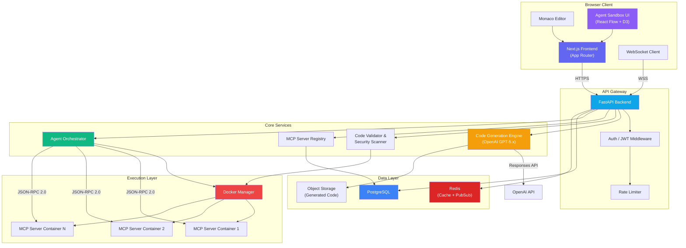
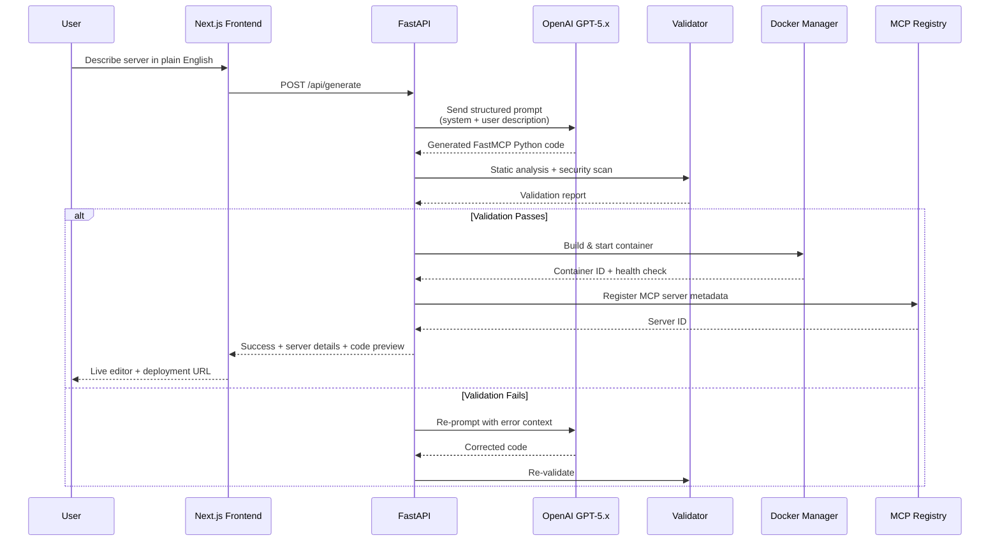
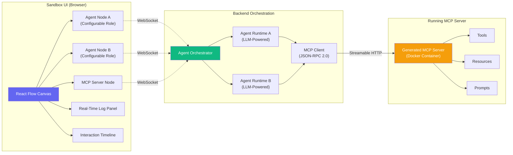
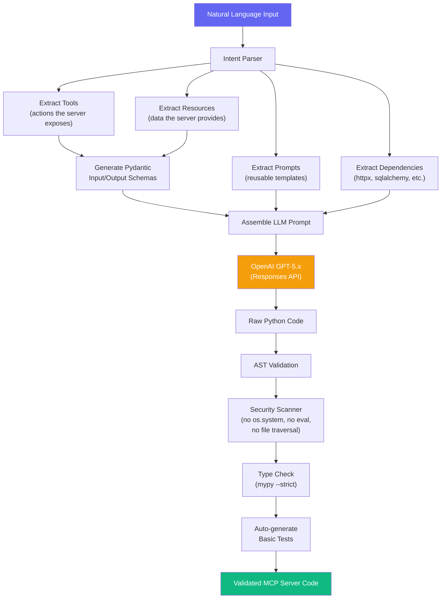
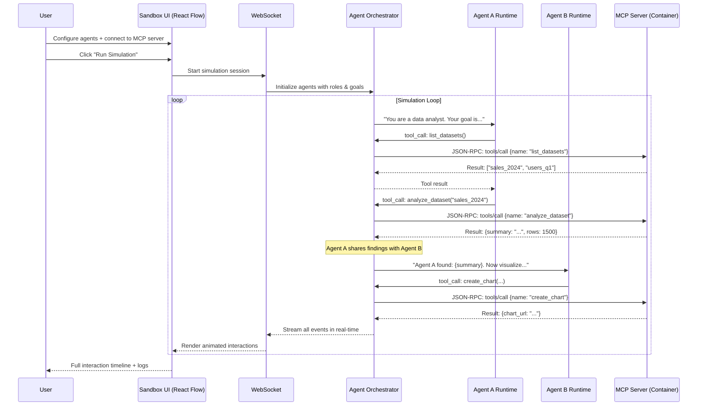
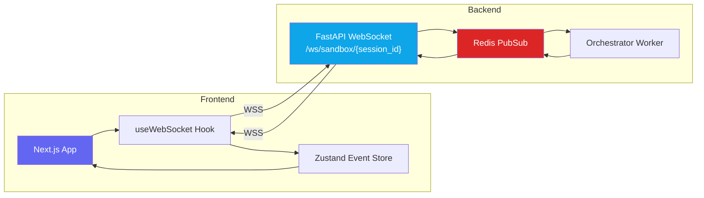
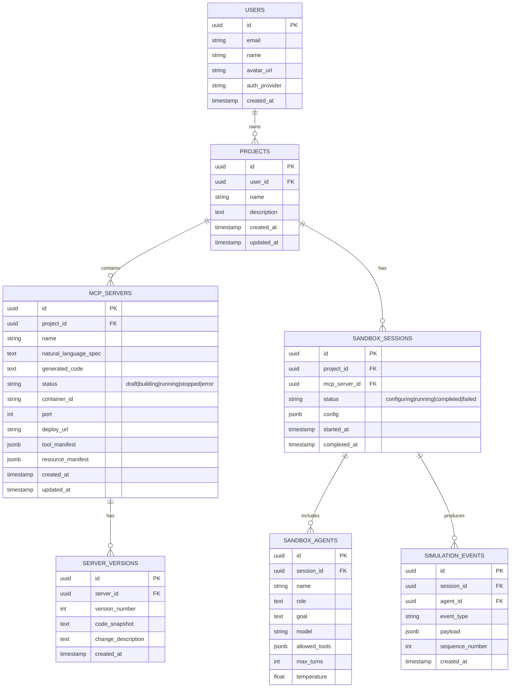
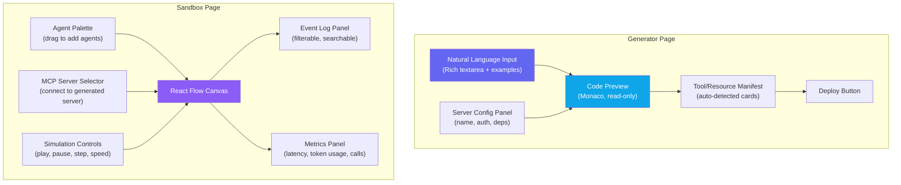

# AgentBridge AI — Implementation Plan

A platform that lets developers instantly generate secure, custom MCP (Model Context Protocol) servers using plain English, and visually simulate how multi-agent systems interact with them in real time.

---

## 1. System Architecture Overview



---

## 2. Core Feature Architecture

### 2.1 MCP Server Generation Pipeline



### 2.2 Multi-Agent Sandbox Architecture



---

## 3. Tech Stack

| Layer | Technology | Rationale |
|:---|:---|:---|
| **Frontend** | Next.js 15 (App Router) | SSR, file-based routing, React Server Components |
| **UI Components** | shadcn/ui + Radix | Accessible, composable, themeable |
| **Code Editor** | Monaco Editor (@monaco-editor/react) | VS Code-grade editing in-browser |
| **Agent Visualization** | React Flow + Framer Motion | Node-graph canvas for agent simulation |
| **Styling** | Tailwind CSS 4 | Utility-first, rapid iteration |
| **Backend API** | FastAPI (Python 3.12+) | Async, OpenAPI auto-docs, Pydantic validation |
| **MCP SDK** | FastMCP (Python) | Official high-level MCP server builder |
| **AI Code Gen** | OpenAI Responses API (GPT-5.x) | Best-in-class code generation with reasoning |
| **Database** | PostgreSQL 16 | Relational store for users, servers, projects |
| **Cache / PubSub** | Redis 7 | Session cache, real-time event streaming |
| **Containerization** | Docker Engine API | Isolated MCP server execution |
| **Auth** | NextAuth.js + JWT | GitHub/Google OAuth, session management |
| **Package Management** | pnpm (JS) + uv (Python) | Fast, disk-efficient, lockfile-safe |
| **Monorepo** | Turborepo | Unified builds, caching, task orchestration |
| **Deployment** | Vercel (frontend) + Fly.io/Railway (backend) | Edge CDN + container hosting |

---

## 4. Monorepo Structure

```
AgentBridge AI/
├── apps/
│   ├── web/                          # Next.js 15 frontend
│   │   ├── app/
│   │   │   ├── (auth)/               # Auth routes (login, register)
│   │   │   ├── (dashboard)/          # Protected dashboard routes
│   │   │   │   ├── projects/         # Project management
│   │   │   │   ├── generator/        # MCP server generator UI
│   │   │   │   ├── sandbox/          # Multi-agent sandbox
│   │   │   │   └── servers/          # Server management & monitoring
│   │   │   ├── (marketing)/          # Public landing page
│   │   │   ├── api/                  # Next.js API routes (BFF)
│   │   │   ├── layout.tsx
│   │   │   └── page.tsx
│   │   ├── components/
│   │   │   ├── editor/               # Monaco editor wrapper
│   │   │   ├── sandbox/              # React Flow agent canvas
│   │   │   ├── generator/            # Generation wizard components
│   │   │   └── ui/                   # shadcn/ui components
│   │   ├── lib/                      # Utilities, API client, hooks
│   │   ├── styles/
│   │   └── next.config.ts
│   │
│   └── api/                          # FastAPI backend
│       ├── app/
│       │   ├── main.py               # FastAPI app entry
│       │   ├── core/
│       │   │   ├── config.py          # Settings via pydantic-settings
│       │   │   ├── security.py        # Auth, JWT, RBAC
│       │   │   └── events.py          # Startup/shutdown lifecycle
│       │   ├── api/
│       │   │   ├── v1/
│       │   │   │   ├── generate.py    # Code generation endpoints
│       │   │   │   ├── servers.py     # MCP server CRUD
│       │   │   │   ├── sandbox.py     # Sandbox session management
│       │   │   │   ├── projects.py    # Project management
│       │   │   │   └── ws.py          # WebSocket handlers
│       │   │   └── deps.py            # Dependency injection
│       │   ├── services/
│       │   │   ├── codegen.py         # OpenAI code generation service
│       │   │   ├── validator.py       # AST validation + security scan
│       │   │   ├── docker_mgr.py      # Docker container lifecycle
│       │   │   ├── mcp_registry.py    # MCP server registry
│       │   │   └── agent_orchestrator.py  # Multi-agent runtime
│       │   ├── models/                # SQLAlchemy ORM models
│       │   ├── schemas/               # Pydantic request/response schemas
│       │   └── prompts/               # LLM prompt templates
│       │       ├── system_prompt.py
│       │       └── templates/
│       ├── tests/
│       ├── Dockerfile
│       └── pyproject.toml
│
├── packages/
│   ├── shared-types/                  # Shared TypeScript types (OpenAPI-generated)
│   ├── mcp-templates/                 # Base MCP server templates & snippets
│   └── ui/                            # Shared UI component library
│
├── docker/
│   ├── sandbox-base/                  # Base image for MCP server containers
│   │   ├── Dockerfile
│   │   └── requirements.txt           # Pre-installed: fastmcp, httpx, pydantic
│   └── docker-compose.yml             # Local dev stack
│
├── turbo.json
├── pnpm-workspace.yaml
├── package.json
└── README.md
```

---

## 5. Detailed Component Design

### 5.1 Code Generation Engine

The core differentiator — turning natural language into production-ready FastMCP server code.



**Prompt Engineering Strategy:**

The system prompt instructs the LLM to generate code following this exact template:

```python
# Generated by AgentBridge AI
from fastmcp import FastMCP
from pydantic import BaseModel, Field
# ... additional imports based on user description

mcp = FastMCP("{{server_name}}")

# --- Pydantic Models ---
class {{ModelName}}(BaseModel):
    """{{description}}"""
    {{fields}}

# --- Tools ---
@mcp.tool
async def {{tool_name}}({{params}}) -> {{return_type}}:
    """{{tool_description}}"""
    {{implementation}}

# --- Resources ---
@mcp.resource("{{uri_pattern}}")
async def {{resource_name}}() -> str:
    """{{resource_description}}"""
    {{implementation}}

# --- Prompts ---
@mcp.prompt
def {{prompt_name}}({{params}}) -> str:
    """{{prompt_description}}"""
    return f"{{template}}"

if __name__ == "__main__":
    mcp.run(transport="sse", port={{port}})
```

**Security Scanner Rules (Blocklist):**
- `os.system()`, `subprocess.*`, `eval()`, `exec()`, `__import__()`
- File system access outside `/app/data/`
- Network calls to internal IPs (SSRF prevention)
- Import of disallowed modules (`ctypes`, `socket` raw access)

---

### 5.2 Agent Sandbox Orchestrator



**Agent Configuration Model:**

Each agent in the sandbox has:
| Property | Type | Description |
|:---|:---|:---|
| `name` | string | Human-readable label (e.g., "Data Analyst") |
| `role` | string | System prompt / persona description |
| `goal` | string | What this agent is trying to accomplish |
| `model` | enum | LLM model to use (gpt-5.5, gpt-4.1, etc.) |
| `allowed_tools` | string[] | Which MCP tools this agent can call |
| `max_turns` | int | Maximum interaction rounds |
| `temperature` | float | Creativity vs. determinism |

---

### 5.3 Real-Time Communication Layer



**WebSocket Event Protocol:**

```typescript
// Events flowing from backend → frontend
type SandboxEvent =
  | { type: "agent:thinking";    agentId: string; content: string }
  | { type: "agent:tool_call";   agentId: string; toolName: string; args: Record<string, any> }
  | { type: "mcp:tool_result";   toolName: string; result: any; durationMs: number }
  | { type: "agent:message";     agentId: string; targetAgentId: string; content: string }
  | { type: "agent:complete";    agentId: string; summary: string }
  | { type: "simulation:done";   totalTurns: number; durationMs: number }
  | { type: "error";             code: string; message: string }
```

---

## 6. Database Schema



---

## 7. Landing Page & Key UI Screens

### 7.1 Application Screens

| Screen | Route | Purpose |
|:---|:---|:---|
| **Landing Page** | `/` | Hero, value prop, demo video, pricing |
| **Dashboard** | `/dashboard` | Project overview, quick actions, usage stats |
| **Generator** | `/generator` | NL input → code preview → deploy wizard |
| **Code Editor** | `/servers/[id]/edit` | Monaco editor with live MCP server code |
| **Server Dashboard** | `/servers/[id]` | Server health, tool manifest, logs, test console |
| **Agent Sandbox** | `/sandbox/[id]` | React Flow canvas, agent config, simulation controls |
| **Simulation Replay** | `/sandbox/[id]/replay/[sessionId]` | Timeline playback of past simulations |

### 7.2 UI Component Architecture



---

## 8. Phased Delivery Plan

### Phase 1 — Foundation (Weeks 1–3)
> Monorepo setup, auth, database, basic UI shell

- [ ] Initialize Turborepo monorepo with Next.js + FastAPI
- [ ] Configure pnpm workspaces + uv for Python
- [ ] Set up PostgreSQL with SQLAlchemy + Alembic migrations
- [ ] Implement NextAuth.js (GitHub + Google OAuth)
- [ ] Build landing page with premium dark-mode design
- [ ] Create dashboard shell with sidebar navigation
- [ ] Set up Docker Compose for local dev (Postgres, Redis, API, Web)
- [ ] Configure CI/CD pipeline (lint, typecheck, test)

### Phase 2 — Code Generation Engine (Weeks 4–6)
> The core NL → MCP server pipeline

- [ ] Build prompt engineering framework (system prompts, templates)
- [ ] Integrate OpenAI Responses API for code generation
- [ ] Implement AST-based code validator
- [ ] Build security scanner (blocklist + static analysis)
- [ ] Create Generator UI (NL input, config panel, code preview)
- [ ] Wire Monaco Editor for generated code editing
- [ ] Implement iterative refinement loop (validation → re-prompt)
- [ ] Build MCP server registry (CRUD + metadata)

### Phase 3 — Container Runtime (Weeks 7–8)
> Spin up generated MCP servers in isolated containers

- [ ] Create base Docker image with FastMCP + common deps
- [ ] Build Docker Manager service (create, start, stop, destroy)
- [ ] Implement container health checks + auto-restart
- [ ] Add resource limits (CPU, memory, network isolation)
- [ ] Build server dashboard (health, logs, tool manifest)
- [ ] Implement MCP tool testing console (manual tool invocation)
- [ ] Add deploy URL routing (reverse proxy)

### Phase 4 — Multi-Agent Sandbox (Weeks 9–12)
> Visual agent simulation environment

- [ ] Build React Flow canvas with custom agent/MCP nodes
- [ ] Implement agent configuration panel (role, goal, model, tools)
- [ ] Build Agent Orchestrator backend service
- [ ] Implement MCP client (JSON-RPC 2.0 over Streamable HTTP)
- [ ] Set up WebSocket layer for real-time event streaming
- [ ] Build event log panel with filtering
- [ ] Implement simulation controls (play, pause, step-through, speed)
- [ ] Build interaction timeline visualization
- [ ] Add simulation replay from stored events
- [ ] Build metrics panel (latency, token usage, tool call frequency)

### Phase 5 — Polish & Ship (Weeks 13–14)
> Production hardening, docs, and launch prep

- [ ] Comprehensive error handling and user-facing error messages
- [ ] Rate limiting and usage quotas
- [ ] API documentation (auto-generated from OpenAPI)
- [ ] User onboarding flow with interactive tutorial
- [ ] Export capabilities (download generated code, export simulation logs)
- [ ] Performance optimization (code splitting, lazy loading, caching)
- [ ] End-to-end testing (Playwright)
- [ ] Deploy to production (Vercel + Fly.io/Railway)

---

## 9. User Review Required

> [!IMPORTANT]
> **AI Model Selection**: The plan uses OpenAI's GPT-5.x via the Responses API for code generation. Should we also support alternative models (e.g., Gemini 2.5 Pro, Claude) as selectable backends, or is OpenAI-only acceptable for the MVP?

> [!IMPORTANT]
> **Container Hosting Strategy**: Running Docker containers for each generated MCP server requires a container-capable host (Fly.io, Railway, AWS ECS). This has significant cost implications at scale. Should we explore a Pyodide/WASM-based in-browser execution option for a lighter "preview" mode?

> [!WARNING]
> **Scope vs. Timeline**: The full 5-phase plan targets ~14 weeks. If you want a faster MVP, we could cut Phase 4 (Sandbox) to a simpler "single-agent test console" and deliver in ~8 weeks, then iterate on the full multi-agent sandbox as Phase 2 of the product.

---

---

## 11. Verification Plan

### Automated Tests
- **Unit tests**: pytest for all backend services (codegen, validator, docker_mgr, orchestrator)
- **Integration tests**: Test full NL → code → container → tool_call pipeline
- **E2E tests**: Playwright for critical user flows (generate → deploy → test → sandbox)
- **Contract tests**: Validate generated MCP servers respond correctly to `tools/list`, `tools/call`

### Manual Verification
- Generate MCP servers from 10+ diverse NL descriptions and verify correctness
- Run sandbox simulations with 2–4 agents and verify real-time visualization
- Test security scanner against known-malicious code patterns
- Performance testing: code generation latency < 10s, container startup < 5s
- Browser testing across Chrome, Firefox, Safari
